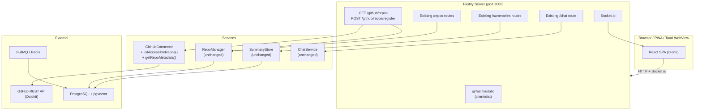
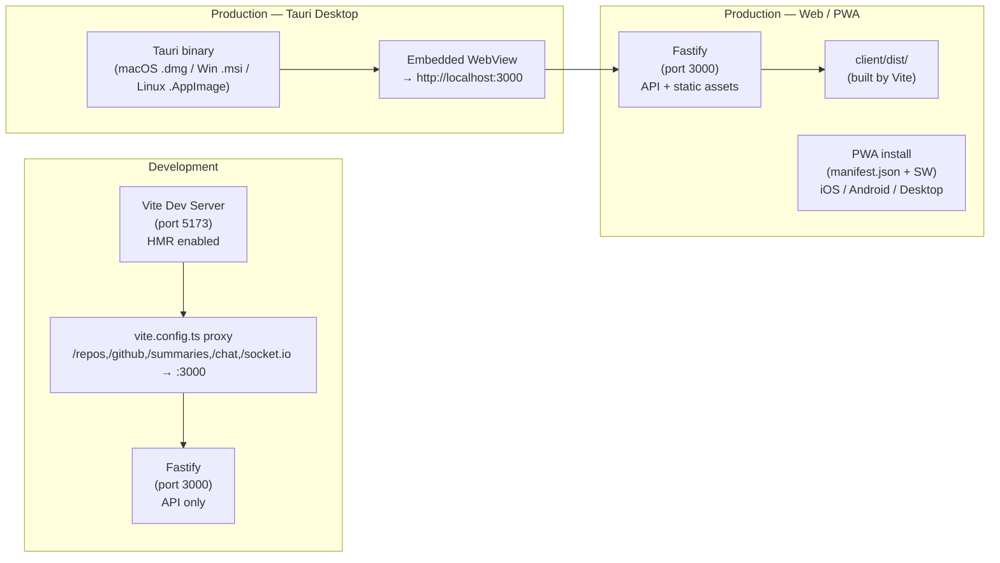

 Design Document: GitHub Repo Discovery

## Overview

This feature extends GitScripe in two dimensions:

1. **Backend** — A new `Discovery_Service` layer built on top of the existing `GitHubConnector` and `RepoManager`. Two new methods are added to `GitHubConnector` (`listAccessibleRepos`, `getRepoMetadata`), and a new Fastify route file `src/api/routes/github.ts` exposes `GET /github/repos` and `POST /github/repos/register`. The existing `server.ts` is updated to register these routes and serve the compiled React SPA as static assets via `@fastify/static`.

2. **Frontend** — A React 18 + Vite SPA in a `client/` directory at the project root, enhanced as a **Progressive Web App (PWA)** and optionally wrapped in a **Tauri 2.0 desktop shell**. The same `client/dist` output serves all three surfaces:
   - **Web** — served by Fastify's `@fastify/static`, accessible in any browser
   - **PWA** — installable on iOS, Android, macOS, Windows, Linux directly from the browser via `manifest.json` + service worker; no App Store required
   - **Tauri desktop** — native binary (macOS `.dmg`, Windows `.msi`, Linux `.AppImage`) wrapping the same webview; adds system tray, native window management, and dock icon

   The developer-tool dashboard covers four workflows: repository discovery & registration, sync progress monitoring, commit summaries browsing, and AI chat. In production, Fastify serves `client/dist`. In development, Vite's dev server (port 5173) proxies API calls to Fastify on port 3000.

The design is intentionally additive — no existing backend files are deleted or restructured beyond targeted additions.

---

## Architecture

### High-Level Component Diagram



### Development vs Production Serving



In development, Vite runs on port 5173 and proxies all API paths to Fastify on port 3000. In production, `@fastify/static` serves `client/dist` and a catch-all returns `index.html` for SPA navigation. The PWA layer (manifest + service worker) is part of the same build output. The Tauri shell is a separate optional build step (`tauri build`) that wraps the webview pointing at the running Fastify server.

---

## Components and Interfaces

### Backend Components

#### 1. GitHubConnector — New Methods

Two new public methods are added to the existing `GitHubConnector` class. No existing methods are modified.

```typescript
// src/connectors/GitHubConnector.ts (additions)

export interface AccessibleRepo {
  owner: string;
  name: string;
  fullName: string;       // "owner/name"
  defaultBranch: string;
  private: boolean;
  description: string | null;
  htmlUrl: string;
}

export interface RepoMetadata {
  defaultBranch: string;
  description: string | null;
  private: boolean;
  htmlUrl: string;
}
```

**`listAccessibleRepos(): Promise<AccessibleRepo[]>`**

- Calls `this.getRateLimit()` first. If `remaining < 10`, throws `Error` with message: `"GitHub rate limit too low: ${remaining} remaining, resets at ${reset.toISOString()}"`.
- Uses `this.octokit.paginate.iterator(this.octokit.rest.repos.listForAuthenticatedUser, { per_page: 100, affiliation: 'owner,collaborator,organization_member' })` to page through all results.
- Maps each item to `AccessibleRepo`, reading `default_branch` directly from the list response (no extra per-repo call needed).
- Returns the full flat array after all pages are consumed.

**`getRepoMetadata(owner: string, repo: string): Promise<RepoMetadata>`**

- Calls `this.octokit.rest.repos.get({ owner, repo })`.
- If the Octokit call throws a 404, re-throws with message: `"Repository ${owner}/${repo} not found or not accessible"`.
- Returns `{ defaultBranch, description, private, htmlUrl }` from the response data.

#### 2. New Zod Schemas — `src/models/schemas.ts` (additions)

```typescript
// Represents a single repo returned by GET /github/repos
export const DiscoveredRepoSchema = z.object({
  owner: z.string(),
  name: z.string(),
  fullName: z.string(),
  defaultBranch: z.string(),
  private: z.boolean(),
  description: z.string().nullable(),
  htmlUrl: z.string().url(),
  isRegistered: z.boolean(),
});

// Request body for POST /github/repos/register
export const RegisterDiscoveredRepoSchema = z.object({
  fullName: z
    .string()
    .regex(
      /^[\w.-]+\/[\w.-]+$/,
      'fullName must be in owner/repo format (alphanumeric, hyphens, underscores, dots)'
    ),
  branch: z.string().min(1).optional(), // overrides defaultBranch when provided
});

export type DiscoveredRepo = z.infer<typeof DiscoveredRepoSchema>;
export type RegisterDiscoveredRepoInput = z.infer<typeof RegisterDiscoveredRepoSchema>;
```

#### 3. New Route File — `src/api/routes/github.ts`

This file registers two routes on the Fastify instance. It depends on `GitHubConnector`, `RepoManager`, and `PrismaClient`.

```typescript
interface GithubRouteDeps {
  githubConnector: GitHubConnector;
  repoManager: RepoManager;
  prisma: PrismaClient;
}

export async function githubRoutes(
  fastify: FastifyInstance,
  deps: GithubRouteDeps
): Promise<void>
```

**`GET /github/repos`**

1. Calls `githubConnector.listAccessibleRepos()`.
2. Fetches all registered `githubUrl` values from `prisma.repository.findMany({ select: { githubUrl: true } })`.
3. Builds a normalized Set of registered URLs: lowercase, trailing slash stripped.
4. For each `AccessibleRepo`, sets `isRegistered = normalizedSet.has(normalize(repo.htmlUrl))`.
5. Returns `{ repos: DiscoveredRepo[] }` with HTTP 200.
6. On rate limit error (message contains "rate limit"), returns HTTP 429 `{ error, resetAt }`.
7. On Octokit 401, returns HTTP 401 `{ error: "GitHub token is invalid or expired" }`.

**`POST /github/repos/register`**

1. Parses body with `RegisterDiscoveredRepoSchema.parse(request.body)`. On `ZodError`, returns HTTP 400 with field-level details.
2. Splits `fullName` into `[owner, repo]`.
3. Calls `githubConnector.getRepoMetadata(owner, repo)` to resolve `defaultBranch`.
4. On 404 error from connector, returns HTTP 404 `{ error: "Repository not found or not accessible" }`.
5. Determines effective branch: `body.branch ?? metadata.defaultBranch`.
6. Calls `repoManager.register(metadata.htmlUrl, effectiveBranch)`.
7. If `repoManager.register` returns an existing repo (upsert), checks if it was pre-existing by comparing `createdAt` proximity — or simply always returns HTTP 201 for new and HTTP 200 for existing (RepoManager's upsert handles idempotency; the route checks if the repo already existed by querying before registering).
8. Returns HTTP 201 with the `RepositoryInfo` object on new registration, HTTP 200 on existing.

#### 4. `server.ts` Changes

Two additions to the existing `createServer` function:

**Register github routes** (after existing route registrations):
```typescript
import { githubRoutes } from './routes/github.js';
// ...
await githubRoutes(fastify, { githubConnector, repoManager, prisma });
```

**Serve SPA static assets** (after all API routes, before `start()`):
```typescript
import fastifyStatic from '@fastify/static';
import { fileURLToPath } from 'url';
import path from 'path';

const __dirname = path.dirname(fileURLToPath(import.meta.url));
const clientDist = path.resolve(__dirname, '../../client/dist');

// Only register static serving if the build output exists
if (fs.existsSync(clientDist)) {
  await fastify.register(fastifyStatic, {
    root: clientDist,
    prefix: '/',
    decorateReply: false,
  });

  // SPA fallback: serve index.html for all non-API, non-asset routes
  fastify.setNotFoundHandler(async (request, reply) => {
    if (
      !request.url.startsWith('/repos') &&
      !request.url.startsWith('/github') &&
      !request.url.startsWith('/summaries') &&
      !request.url.startsWith('/chat') &&
      !request.url.startsWith('/health') &&
      !request.url.startsWith('/admin') &&
      !request.url.startsWith('/socket.io')
    ) {
      return reply.sendFile('index.html');
    }
    return reply.code(404).send({ error: 'Not found' });
  });
}
```

---

### Frontend Components

#### Architecture: One Codebase, Three Surfaces

```
client/dist/          ← Vite build output
    index.html
    assets/
    manifest.json     ← PWA manifest
    sw.js             ← Service worker (Workbox)
    icons/            ← PWA icons (192, 512, maskable)

Surfaces:
  1. Web (browser)    → Fastify serves client/dist via @fastify/static
  2. PWA              → Same build, browser install prompt, offline shell cache
  3. Tauri desktop    → src-tauri/ wraps the webview pointing at localhost:3000
```

No React Native, no Expo, no NativeWind. Pure React 18 + Tailwind CSS v3 + shadcn/ui. The same `client/dist` output is consumed by all three surfaces without modification.

#### Project Structure

```
client/
├── index.html
├── package.json
├── tsconfig.json
├── vite.config.ts              # Vite + PWA plugin config
├── tailwind.config.ts          # Design tokens
├── postcss.config.js
├── public/
│   ├── manifest.json           # PWA manifest
│   └── icons/                  # 192x192, 512x512, maskable
└── src/
    ├── main.tsx                # React root, QueryClient, BrowserRouter
    ├── App.tsx                 # Route definitions
    ├── sw.ts                   # Service worker (Workbox, registered by vite-plugin-pwa)
    ├── lib/
    │   ├── api.ts              # Typed fetch wrapper
    │   └── socket.ts           # Socket.io singleton
    ├── store/
    │   └── appStore.ts         # Zustand (activeRepoId, chatHistory)
    ├── hooks/
    │   ├── useGithubRepos.ts
    │   ├── useRepos.ts
    │   ├── useSyncProgress.ts
    │   ├── useSummaries.ts
    │   └── useChat.ts
    ├── components/
    │   ├── layout/
    │   │   ├── AppShell.tsx    # Sidebar + main content
    │   │   └── Sidebar.tsx     # Repo list nav with status chips
    │   ├── repos/
    │   │   ├── RepoRow.tsx
    │   │   ├── StatusBadge.tsx
    │   │   └── SyncProgressModal.tsx
    │   ├── summaries/
    │   │   ├── SummaryCard.tsx
    │   │   ├── RiskBadge.tsx
    │   │   └── SummaryFilters.tsx
    │   └── chat/
    │       ├── ChatPanel.tsx
    │       ├── ChatMessage.tsx
    │       └── CitedCommitChip.tsx
    └── pages/
        ├── DiscoverPage.tsx    # /
        └── RepoDetailPage.tsx  # /repos/:id

src-tauri/                      # Optional Tauri desktop shell
├── Cargo.toml
├── tauri.conf.json             # Points webview at http://localhost:3000
└── src/
    └── main.rs                 # Minimal — no custom Rust commands needed
```

#### Tech Stack

| Concern | Library | Version | Notes |
|---|---|---|---|
| UI framework | React | 18 | |
| Language | TypeScript | 5 | |
| Build tool | Vite | 5 | |
| PWA | vite-plugin-pwa | latest | Workbox under the hood |
| Server state | TanStack Query | v5 | |
| Client state | Zustand | 4 | |
| Routing | React Router | v6 | |
| Styling | Tailwind CSS | v3 | |
| Components | shadcn/ui | latest | Radix UI primitives |
| Real-time | socket.io-client | 4 | |
| Desktop shell | Tauri | 2.0 | Optional, separate build step |

#### `client/vite.config.ts`

```typescript
import { defineConfig } from 'vite';
import react from '@vitejs/plugin-react';
import { VitePWA } from 'vite-plugin-pwa';
import path from 'path';

export default defineConfig({
  plugins: [
    react(),
    VitePWA({
      registerType: 'autoUpdate',
      workbox: {
        // Cache-first for static assets, network-first for API calls
        runtimeCaching: [
          {
            urlPattern: /^\/(repos|github|summaries|chat)/,
            handler: 'NetworkFirst',
            options: { cacheName: 'api-cache', networkTimeoutSeconds: 5 },
          },
        ],
      },
      manifest: {
        name: 'GitScripe',
        short_name: 'GitScripe',
        description: 'AI-powered commit intelligence',
        theme_color: '#0f1117',
        background_color: '#0f1117',
        display: 'standalone',
        icons: [
          { src: '/icons/icon-192.png', sizes: '192x192', type: 'image/png' },
          { src: '/icons/icon-512.png', sizes: '512x512', type: 'image/png' },
          { src: '/icons/icon-512-maskable.png', sizes: '512x512', type: 'image/png', purpose: 'maskable' },
        ],
      },
    }),
  ],
  resolve: { alias: { '@': path.resolve(__dirname, './src') } },
  server: {
    port: 5173,
    proxy: {
      '/repos':     { target: 'http://localhost:3000', changeOrigin: true },
      '/github':    { target: 'http://localhost:3000', changeOrigin: true },
      '/summaries': { target: 'http://localhost:3000', changeOrigin: true },
      '/chat':      { target: 'http://localhost:3000', changeOrigin: true },
      '/socket.io': { target: 'http://localhost:3000', changeOrigin: true, ws: true },
    },
  },
});
```

#### `src-tauri/tauri.conf.json` — Tauri Shell Config

The Tauri shell is intentionally minimal — no custom Rust commands. It just wraps the webview.

```json
{
  "tauri": {
    "windows": [{ "title": "GitScripe", "width": 1280, "height": 800, "url": "http://localhost:3000" }],
    "systemTray": {
      "iconPath": "icons/icon.png",
      "iconAsTemplate": true,
      "menuOnLeftClick": false
    },
    "bundle": {
      "identifier": "dev.gitscripe.app",
      "icon": ["icons/icon.icns", "icons/icon.ico", "icons/icon.png"]
    },
    "security": { "csp": null }
  }
}
```

#### `client/src/lib/api.ts` — Typed API Client

```typescript
async function apiFetch<T>(path: string, init?: RequestInit): Promise<T> {
  const res = await fetch(path, { headers: { 'Content-Type': 'application/json' }, ...init });
  if (!res.ok) {
    const body = await res.json().catch(() => ({}));
    throw Object.assign(new Error(body.error ?? `HTTP ${res.status}`), { status: res.status, body });
  }
  return res.json() as Promise<T>;
}

export const api = {
  github: {
    listRepos: () => apiFetch<{ repos: DiscoveredRepo[] }>('/github/repos'),
    register: (fullName: string, branch?: string) =>
      apiFetch<RepositoryInfo>('/github/repos/register', {
        method: 'POST', body: JSON.stringify({ fullName, branch }),
      }),
  },
  repos: {
    list: () => apiFetch<{ repos: RepositoryInfo[] }>('/repos'),
    sync: (id: string) => apiFetch<{ message: string }>(`/repos/${id}/sync`, { method: 'POST' }),
    progress: (id: string) => apiFetch<{ repo: RepositoryInfo; progress: SyncProgress }>(`/repos/${id}/progress`),
  },
  summaries: {
    list: (repoId: string, params: { page?: number; limit?: number; riskLevel?: string; tag?: string }) =>
      apiFetch<{ summaries: SummaryInfo[]; total: number }>(`/summaries?repoId=${repoId}&${new URLSearchParams(params as any)}`),
  },
  chat: {
    query: (question: string, repoId: string) =>
      apiFetch<ChatResponse>('/chat', { method: 'POST', body: JSON.stringify({ question, repoId }) }),
  },
};
```

#### `client/src/lib/socket.ts` — Socket.io Singleton

```typescript
import { io, Socket } from 'socket.io-client';

let socket: Socket | null = null;

export function getSocket(): Socket {
  if (!socket) socket = io({ path: '/socket.io', transports: ['websocket'] });
  return socket;
}

export function subscribeToRepo(repoId: string): void {
  getSocket().emit('subscribe:repo', repoId);
}
```

Socket.io works identically in browser, PWA, and Tauri webview — no changes needed.

#### Key Hooks

**`useSyncProgress`** — polls while syncing, stops when done:
```typescript
export function useSyncProgress(repoId: string | null) {
  return useQuery({
    queryKey: ['sync-progress', repoId],
    queryFn: () => api.repos.progress(repoId!),
    enabled: !!repoId,
    refetchInterval: (query) => {
      const status = query.state.data?.repo.status;
      return status === 'syncing' ? 3000 : false;
    },
  });
}
```

**`useRegisterRepo`** — mutation with cache invalidation:
```typescript
export function useRegisterRepo() {
  const qc = useQueryClient();
  return useMutation({
    mutationFn: ({ fullName, branch }: { fullName: string; branch?: string }) =>
      api.github.register(fullName, branch),
    onSuccess: () => {
      qc.invalidateQueries({ queryKey: ['github-repos'] });
      qc.invalidateQueries({ queryKey: ['repos'] });
    },
  });
}
```

---

## Pages and UI Design

### Design Language

- Base background: `#0f1117` (near-black)
- Surface: `#161b22` (GitHub dark surface)
- Border: `#30363d`
- Text primary: `#e6edf3`
- Text muted: `#8b949e`
- Accent: `#58a6ff` (blue)
- Success: `#3fb950` (green)
- Warning: `#d29922` (yellow)
- Error: `#f85149` (red)
- Monospace font for SHAs, branch names: `font-mono`
- Minimum touch target: 44×44pt (iOS HIG / Android Material) on all interactive elements

Status chip colors: idle → gray, syncing → blue (pulsing), error → red.
Risk badge colors: low → green, medium → yellow, high → red.

### Navigation Structure

```
All surfaces (Web / PWA / Tauri)
─────────────────────────────────
Fixed sidebar (240px, collapsible on narrow viewports)
  ├── Discover → /
  └── [Registered repo list] → /repos/:id

Route: /repos/:id
  ├── Summaries panel (60% width)
  └── Chat panel     (40% width, sticky)
```

The sidebar is always visible on desktop (≥768px). On narrow viewports (mobile PWA), it collapses to a hamburger menu that opens a slide-over drawer using shadcn/ui `Sheet`. The repo detail page renders both panels side-by-side on desktop and stacks them vertically (summaries above, chat below) on mobile.

### Page 1: Discover (`/`)

**Layout**: Scrollable `<ul>` of `RepoRow` components inside the main content area. Top bar has a `<input type="search">` (client-side filter) and a "Refresh" `<button>`.

**RepoRow** (min 44px height for touch targets):
- `owner/name` in semibold + monospace branch name in muted text
- Description (1 line, truncated with CSS `text-overflow: ellipsis`)
- Visibility badge (Public / Private)
- `isRegistered` badge + action button row
  - Not registered → "Register" `<button>`
  - Registered + idle → "Sync Now" + "View" `<button>` elements
  - Registered + syncing → disabled "Syncing…" with CSS spinner (`animate-spin`)
  - Registered + error → "Retry Sync" `<button>` (destructive variant)
- Inline `<p>` error text below row on failure

### Page 2: Repository Detail (`/repos/:id`)

**Layout**: Two-column split (60/40) — summaries left, chat right (sticky `position: sticky; top: 0`). On narrow viewports, columns stack vertically.

**Summaries panel**:
- `SummaryFilters` at top (shadcn/ui `Select` for risk level + tag filter)
- Virtualized list of `SummaryCard` with page-based pagination (`<button>` prev/next)
- Each card: short summary, author, date, `RiskBadge`, tags, quality score
- Click expands inline (CSS `max-height` transition): detailed summary, inferred intent, per-file summaries, concepts
- SHA in `<code>` monospace, links to GitHub commit URL via `<a target="_blank" rel="noopener noreferrer">`

**Chat panel**:
- Header: repo name + "Clear" `<button>`
- `<div>` with `overflow-y: auto; display: flex; flex-direction: column-reverse` for message history
- User messages right-aligned (`ml-auto`), assistant messages left-aligned
- `CitedCommitChip` below assistant messages — click toggles inline expansion
- Typing indicator: three animated dots (CSS `animate-bounce` with staggered delay)
- `<textarea>` disabled during loading, submit on "Send" `<button>` or `Ctrl+Enter`

### Sync Progress Modal (`SyncProgressModal`)

Rendered as a shadcn/ui `Dialog` (centered modal overlay on all surfaces).

Content:
```
Syncing owner/repo
████████████░░░░░░░░  62%
124 / 200 commits processed
3 failed  •  Elapsed: 00:42
                  [Dismiss]
```

Auto-dismisses 2s after sync completes. Error state shows "Retry" `<button>`.

---

## Data Models

### `DiscoveredRepo` (API response shape)

```typescript
interface DiscoveredRepo {
  owner: string;
  name: string;
  fullName: string;        // "owner/name"
  defaultBranch: string;
  private: boolean;
  description: string | null;
  htmlUrl: string;         // canonical GitHub URL, used for isRegistered check
  isRegistered: boolean;   // cross-checked against repositories table
}
```

### `RegisterDiscoveredRepoInput` (POST body)

```typescript
interface RegisterDiscoveredRepoInput {
  fullName: string;   // required, pattern: /^[\w.-]+\/[\w.-]+$/
  branch?: string;    // optional override; defaults to API-resolved defaultBranch
}
```

### URL Normalization (isRegistered check)

```typescript
function normalizeUrl(url: string): string {
  return url.toLowerCase().replace(/\/+$/, '').replace(/\.git$/, '');
}
```

Applied to both `repo.htmlUrl` from GitHub and `repository.githubUrl` from the DB before comparison.

### Existing `RepositoryInfo` (unchanged)

The `RepositoryInfo` type from `src/models/types.ts` is returned as-is from `POST /github/repos/register`. No schema changes to the `repositories` table are required.

---

## Correctness Properties

*A property is a characteristic or behavior that should hold true across all valid executions of a system — essentially, a formal statement about what the system should do. Properties serve as the bridge between human-readable specifications and machine-verifiable correctness guarantees.*

### Property 1: isRegistered Consistency

*For any* set of discovered repositories and any set of repositories registered in the database, the `isRegistered` field on each discovered repo must be `true` if and only if the repo's normalized `htmlUrl` appears in the set of registered URLs.

**Validates: Requirements 2.1, 2.2**

### Property 2: URL Normalization Invariance

*For any* repository URL, applying any combination of case variation and trailing slash addition/removal before the `isRegistered` check must produce the same boolean result as the canonical form of that URL.

**Validates: Requirements 2.3**

### Property 3: Response Shape Completeness

*For any* repository returned by `GET /github/repos`, the response object must contain all eight required fields: `owner`, `name`, `fullName`, `defaultBranch`, `private`, `description`, `htmlUrl`, and `isRegistered`.

**Validates: Requirements 1.2**

### Property 4: Pagination Completeness

*For any* GitHub account with N total accessible repositories spread across multiple pages, `listAccessibleRepos()` must return exactly N repositories with no duplicates and no omissions.

**Validates: Requirements 1.5, 4.3**

### Property 5: Rate Limit Guard

*For any* call to `listAccessibleRepos()` where the GitHub API reports fewer than 10 remaining requests, the method must throw an error containing the reset time before issuing any repository listing API call.

**Validates: Requirements 6.1, 6.2**

### Property 6: Registration Idempotency

*For any* repository registered via `POST /github/repos/register`, calling the same endpoint again with the same `fullName` must return the same repository object and must not create a duplicate entry in the database.

**Validates: Requirements 3.5**

### Property 7: Branch Override Respected

*For any* `POST /github/repos/register` request that includes an explicit `branch` field, the registered repository's `branch` must equal the provided value, not the API-resolved `defaultBranch`.

**Validates: Requirements 3.2**

### Property 8: Validation Rejects Malformed Input

*For any* `POST /github/repos/register` request body where `fullName` does not match the pattern `owner/repo` (or is absent), the endpoint must return HTTP 400 without making any GitHub API calls.

**Validates: Requirements 3.6, 5.1, 5.2**

### Property 9: Client-Side Filter Correctness

*For any* list of discovered repositories and any non-empty search string, the filtered result must contain exactly those repositories whose `fullName` (lowercased) includes the search string (lowercased), and no others.

**Validates: Requirements 7.3**

### Property 10: Summary Card Shape

*For any* commit summary rendered in the UI, the rendered card must display: short summary, author, commit date, risk level badge, tags, and quality score.

**Validates: Requirements 9.2**

---

## Error Handling

### Backend Error Map

| Condition | HTTP Status | Response Body |
|---|---|---|
| GitHub token invalid/expired | 401 | `{ error: "GitHub token is invalid or expired" }` |
| Rate limit < 10 remaining | 429 | `{ error: "...", resetAt: ISO8601 }` |
| `fullName` not found / inaccessible | 404 | `{ error: "Repository not found or not accessible" }` |
| Zod validation failure | 400 | `{ error: "Validation failed", details: ZodError.issues }` |
| Unexpected server error | 500 | `{ error: "Internal server error" }` |

### Error Propagation Flow

```
GitHubConnector throws
  → githubRoutes catches by error message pattern
    → maps to appropriate HTTP status + body
      → client api.ts throws Error with .status and .body
        → TanStack Query sets error state
          → component renders inline error message
```

### Frontend Error Handling

- All `api.*` calls are wrapped in TanStack Query mutations/queries. Errors surface via `error` state.
- `RepoRow` displays inline error below the row (not a toast, not a navigation).
- `ChatPanel` displays error inline in the message thread.
- Network errors (fetch failed) show a generic "Connection error — check that the server is running" message.

---

## Testing Strategy

### Dual Testing Approach

Both unit tests and property-based tests are required. They are complementary:
- Unit tests cover specific examples, integration points, and error conditions.
- Property-based tests verify universal correctness across all valid inputs.

### Property-Based Testing

**Library**: [`fast-check`](https://github.com/dubzzz/fast-check) for TypeScript/Node.js backend. For the React frontend, `fast-check` with `@testing-library/react`.

**Configuration**: Each property test runs a minimum of 100 iterations (`numRuns: 100`).

**Tag format**: Each test is annotated with a comment:
`// Feature: github-repo-discovery, Property N: <property_text>`

**Property test implementations**:

| Property | Test description | Arbitraries |
|---|---|---|
| P1: isRegistered Consistency | Generate random repo lists + random registered URL subsets; verify isRegistered matches set membership | `fc.array(fc.record({...}))`, `fc.subarray(...)` |
| P2: URL Normalization | Generate URLs with random case + trailing slashes; verify normalize(url) === normalize(normalize(url)) and set membership is invariant | `fc.string()` with case/slash mutations |
| P3: Response Shape | Generate random AccessibleRepo arrays; call the mapping function; verify all 8 fields present on every item | `fc.array(fc.record({...}))` |
| P4: Pagination Completeness | Mock octokit.paginate.iterator with N pages of M repos each; verify result.length === N*M, no duplicate htmlUrls | `fc.integer({min:1,max:10})` for pages |
| P5: Rate Limit Guard | Generate remaining counts; for < 10 verify throw before any list call; for >= 10 verify no throw | `fc.integer({min:0,max:200})` |
| P6: Registration Idempotency | Call register twice with same fullName; verify DB count === 1 and both responses have same id | `fc.string()` matching owner/repo pattern |
| P7: Branch Override | Generate fullName + branch pairs; verify registered repo.branch === provided branch | `fc.string()` for branch |
| P8: Validation Rejection | Generate strings not matching /^[\w.-]+\/[\w.-]+$/; verify 400 response, no GitHub API call | `fc.string()` filtered to non-matching |
| P9: Client Filter | Generate repo arrays + search strings; verify filter result === repos.filter(r => r.fullName.toLowerCase().includes(q)) | `fc.array(...)`, `fc.string()` |
| P10: Summary Card Shape | Generate SummaryInfo objects; render SummaryCard; verify all required fields present in output | `fc.record({...})` |

### Unit Tests

Unit tests focus on:
- Specific HTTP status code examples (401, 404, 429 error paths)
- `getRepoMetadata` 404 error message format
- `normalizeUrl` with specific known inputs
- `RegisterDiscoveredRepoSchema` with valid and invalid examples
- `SyncProgressModal` auto-dismiss timing
- `ChatPanel` typing indicator appears/disappears correctly

### Test File Locations

```
GitScripe/
└── src/
    └── __tests__/
        ├── connectors/
        │   └── GitHubConnector.discovery.test.ts   # P3, P4, P5 + unit tests
        ├── routes/
        │   └── github.routes.test.ts               # P1, P2, P6, P7, P8 + unit tests
        └── services/
            └── RepoManager.idempotency.test.ts     # P6 integration

client/
└── src/
    └── __tests__/
        ├── lib/
        │   └── api.test.ts                         # error mapping unit tests
        ├── hooks/
        │   └── useGithubRepos.test.ts              # query/mutation behavior
        └── components/
            ├── RepoRow.filter.test.ts              # P9
            └── SummaryCard.shape.test.ts           # P10
```
