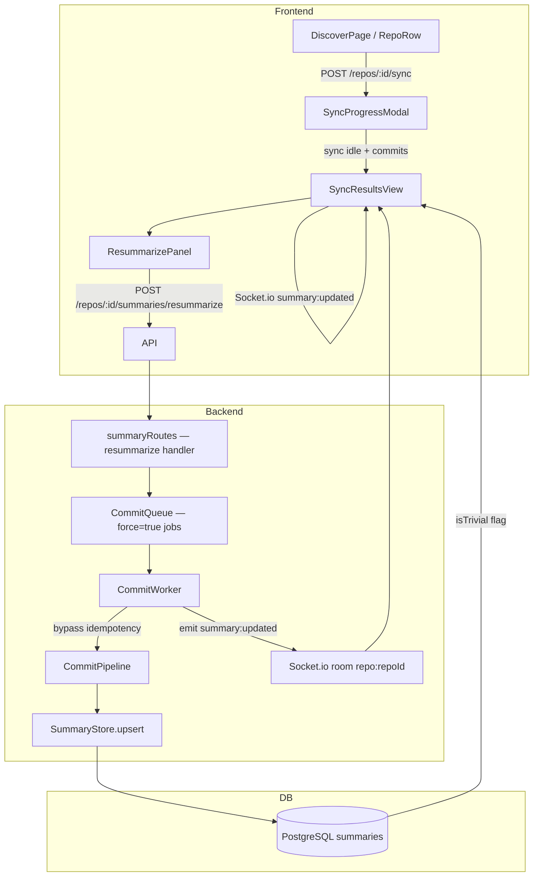

# Design Document: Sync Results & Selective Re-summarization

## Overview

This feature closes two gaps in the current GitScripe sync pipeline:

1. **Silent failure**: `completeSyncCheckpoint` is called immediately after enqueuing jobs, before any CommitWorker has run. Failed commits are permanently dropped — the next sync skips them because `lastSyncedSha` already advanced past them.
2. **No recovery path**: There is no UI surface for inspecting per-commit outcomes or re-triggering the LLM pipeline on specific commits.

The solution has three parts:
- A **schema change** (`isTrivial` flag on `Summary`) to distinguish trivial fast-path commits from LLM-summarized ones.
- A **backend extension**: fix the checkpoint ordering in `syncWorker`, add a `force` flag to `CommitJobData`, add `POST /repos/:repoId/summaries/resummarize` and `GET /config/models` endpoints, and emit `summary:updated` Socket.io events from the CommitWorker.
- A **frontend extension**: replace the auto-dismissing `SyncProgressModal` with a `SyncResultsView` that shows grouped commit outcomes and embeds a `ResummarizePanel` for selective re-processing.

---

## Architecture



The `SyncWorker` fix is purely a sequencing change — `completeSyncCheckpoint` moves to after all `prisma.commit.upsert` and `diffStorage.saveDiff` calls complete, but still before CommitWorker jobs finish (CommitWorker failures are intentionally not rolled back per Requirement 1.4).

---

## Components and Interfaces

### Backend

#### 1. Schema: `Summary.isTrivial`

New boolean field on the `Summary` Prisma model:

```prisma
isTrivial  Boolean  @default(false)
```

The `commitWorker` trivial fast-path sets `isTrivial: true` when calling `summaryStore.upsert`. All other paths leave it `false`.

#### 2. `CommitJobData` — `force` and `overrideModel` fields

```typescript
// src/queues/CommitQueue.ts
export const CommitJobSchema = z.object({
  sha: z.string(),
  repoId: z.string().uuid(),
  owner: z.string(),
  repo: z.string(),
  branch: z.string(),
  force: z.boolean().default(false),
  overrideModel: z.string().optional(),
});
```

When `force: true`, the CommitWorker skips the `status === 'done'` early-return guard. When `overrideModel` is present, it is passed to `SummaryAgent` instead of the default `llmModel`.

#### 3. `SummaryStore` additions

```typescript
// Reset status to pending for re-summarization
async resetToPending(shas: string[]): Promise<void>

// List summaries for a repo with isTrivial included (extend existing listByRepo return type)
// No new method needed — isTrivial is added to the SummaryInfo type and returned by existing queries
```

#### 4. New API routes

**`POST /repos/:repoId/summaries/resummarize`**

```
Body:  { shas: string[], model: string }
202:   { enqueued: number }
400:   { error: 'shas array must not be empty' }
404:   { error: 'Commit not found', sha: string }  (first missing SHA)
```

Handler logic:
1. Validate body — 400 if `shas` is empty.
2. For each SHA, verify a `Commit` record exists — 404 if not.
3. Call `summaryStore.resetToPending(shas)`.
4. Enqueue a `CommitJobData` with `force: true, overrideModel: model` for each SHA.
5. Return 202 `{ enqueued: shas.length }`.

**`GET /config/models`**

```
200: { provider: string, models: string[], default: string }
```

Returns the configured `llmProvider`, a static list of known model identifiers for that provider (see Data Models), and the current `config.llmModel` as the default.

#### 5. `CommitWorker` changes

- After the idempotency check, add: `if (existing && existing.status === 'done' && !job.data.force) { return { skipped: true }; }`
- In the trivial fast-path, pass `isTrivial: true` to `summaryStore.upsert`.
- Use `job.data.overrideModel ?? llmModel` when calling the pipeline.
- On job `completed` and `failed` events, emit `summary:updated` to the Socket.io room:

```typescript
worker.on('completed', (job, result) => {
  io.to(`repo:${job.data.repoId}`).emit('summary:updated', {
    repoId: job.data.repoId,
    commitSha: job.data.sha,
    status: result.skipped ? 'done' : 'done',
    isTrivial: result.trivial ?? false,
  });
});

worker.on('failed', (job, error) => {
  if (!job) return;
  io.to(`repo:${job.data.repoId}`).emit('summary:updated', {
    repoId: job.data.repoId,
    commitSha: job.data.sha,
    status: 'failed',
    errorMessage: error.message,
  });
});
```

The `io` instance is passed into `createCommitWorker` as a new optional dep.

#### 6. `SyncWorker` fix

Move `completeSyncCheckpoint` to after the commit+diff persistence loop, but keep it before the function returns (not after workers finish). Also add a guard to skip re-enqueuing commits whose summary is already `done` or `failed`:

```typescript
// Before enqueuing, check existing summary status
const existing = await prisma.summary.findUnique({ where: { commitSha: commit.sha } });
if (existing && (existing.status === 'done' || existing.status === 'failed')) {
  continue; // skip — don't re-enqueue
}
```

### Frontend

#### 7. `DisplayStatus` type and mapping utility

```typescript
// client/src/lib/displayStatus.ts
export type DisplayStatus = 'Summarized' | 'Skipped' | 'Processing' | 'Queued' | 'Failed';

export function toDisplayStatus(status: string, isTrivial: boolean): DisplayStatus {
  if (status === 'done') return isTrivial ? 'Skipped' : 'Summarized';
  if (status === 'processing') return 'Processing';
  if (status === 'pending') return 'Queued';
  return 'Failed';
}

export function shouldAutoDismiss(summaries: SummaryInfo[]): boolean {
  return summaries.length > 0 &&
    summaries.every(s => {
      const ds = toDisplayStatus(s.status, s.isTrivial ?? false);
      return ds === 'Summarized' || ds === 'Skipped';
    });
}

export function isSelectable(status: DisplayStatus): boolean {
  return status === 'Failed' || status === 'Skipped';
}
```

#### 8. `SyncResultsView` component

Replaces the progress bar content in `SyncProgressModal` once `isDone` is true. Stays open if any commit has `DisplayStatus === 'Failed'` or `DisplayStatus === 'Queued'`.

Props:
```typescript
interface SyncResultsViewProps {
  repoId: string;
  summaries: SummaryInfo[];   // fetched via useSummaries after sync completes
  onClose: () => void;
}
```

Renders:
- A grouped list by `DisplayStatus` with per-group counts.
- Each commit row: short SHA (8 chars), author name, DisplayStatus badge, and `errorMessage` for Failed commits.
- Embeds `ResummarizePanel` when any Failed or Skipped commits exist.
- Listens to `summary:updated` Socket.io events and updates local state.

#### 9. `ResummarizePanel` component

Embedded inside `SyncResultsView`. Only renders when there are selectable commits.

Props:
```typescript
interface ResummarizePanelProps {
  repoId: string;
  selectableSummaries: SummaryInfo[];  // Failed + Skipped only
  onComplete: () => void;
}
```

State:
- `selectedShas: Set<string>` — checked commit SHAs
- `selectedModel: string` — from model dropdown
- `isSubmitting: boolean`

Behavior:
- "Select All Failed" button sets `selectedShas` to all SHAs with `DisplayStatus === 'Failed'`.
- Model dropdown populated from `GET /config/models`.
- Pre-selects the `llmModel` of the most recent `done` summary in the repo (from `selectableSummaries` context or a separate query), falling back to the system default.
- Submit calls `POST /repos/:repoId/summaries/resummarize` with `{ shas: [...selectedShas], model: selectedModel }`.
- Disables submit button and shows spinner while `isSubmitting`.

#### 10. `SyncProgressModal` changes

- Remove the unconditional `isDone → setTimeout(onClose, 2000)` effect.
- Replace with: if `isDone && shouldAutoDismiss(summaries)` → auto-dismiss after 2s.
- If `isDone && !shouldAutoDismiss(summaries)` → render `SyncResultsView` instead of the progress bar.

#### 11. `api.ts` additions

```typescript
summaries: {
  // existing list()...
  resummarize: (repoId: string, body: { shas: string[]; model: string }) =>
    apiFetch<{ enqueued: number }>(`/repos/${repoId}/summaries/resummarize`, {
      method: 'POST',
      body: JSON.stringify(body),
    }),
},
config: {
  models: () => apiFetch<{ provider: string; models: string[]; default: string }>('/config/models'),
},
```

#### 12. `SummaryInfo` type update

```typescript
export interface SummaryInfo {
  // ... existing fields ...
  isTrivial: boolean;
  errorMessage: string | null;
}
```

---

## Data Models

### Schema migration

```prisma
model Summary {
  // ... existing fields ...
  isTrivial  Boolean  @default(false)
}
```

Migration: `prisma migrate dev --name add_summary_is_trivial`

### `SummaryUpdatedEvent` (Socket.io payload)

```typescript
interface SummaryUpdatedEvent {
  repoId: string;
  commitSha: string;
  status: 'done' | 'failed' | 'processing';
  isTrivial?: boolean;
  errorMessage?: string;
}
```

### Available models per provider

The `GET /config/models` endpoint returns a static map keyed by provider:

```typescript
const PROVIDER_MODELS: Record<string, string[]> = {
  openai:    ['gpt-4o', 'gpt-4o-mini', 'gpt-4-turbo', 'gpt-3.5-turbo'],
  anthropic: ['claude-3-5-sonnet-20241022', 'claude-3-haiku-20240307', 'claude-3-opus-20240229'],
  gemini:    ['gemini-1.5-pro', 'gemini-1.5-flash', 'gemini-2.0-flash'],
  ollama:    ['llama3.2', 'mistral', 'codellama', 'deepseek-coder'],
  deepseek:  ['deepseek-chat', 'deepseek-coder'],
};
```

The response always includes the currently configured `config.llmModel` even if it's not in the static list (user may have set a custom model via env).

---

## Correctness Properties

*A property is a characteristic or behavior that should hold true across all valid executions of a system — essentially, a formal statement about what the system should do. Properties serve as the bridge between human-readable specifications and machine-verifiable correctness guarantees.*

### Property 1: Checkpoint advances only after persistence

*For any* repository and any list of commits returned by GitHub, `completeSyncCheckpoint` must be called only after every `prisma.commit.upsert` and `diffStorage.saveDiff` call in the loop has resolved — never before.

**Validates: Requirements 1.1**

---

### Property 2: GitHub error leaves checkpoint unchanged

*For any* repository whose `lastSyncedSha` is some value S, if `githubConnector.getCommits` throws an error, then after `runSync` rejects, the repository's `lastSyncedSha` must still equal S and its status must be `error`.

**Validates: Requirements 1.2**

---

### Property 3: Successful sync sets correct checkpoint

*For any* non-empty list of commits fetched from GitHub, after a successful `runSync`, the repository's `lastSyncedSha` must equal the SHA of the last commit in the list and its status must be `idle`.

**Validates: Requirements 1.3**

---

### Property 4: CommitWorker does not modify the checkpoint

*For any* commit job that fails in the CommitWorker, the repository's `lastSyncedSha` and `status` fields must remain unchanged — the CommitWorker must not call `completeSyncCheckpoint` or `markError` on the repository.

**Validates: Requirements 1.4**

---

### Property 5: DisplayStatus mapping is total and correct

*For any* `(status, isTrivial)` pair where `status ∈ {pending, processing, done, failed}` and `isTrivial ∈ {true, false}`, `toDisplayStatus` must return exactly one of `{Summarized, Skipped, Processing, Queued, Failed}` according to the mapping table, with no undefined or unexpected values.

**Validates: Requirements 2.2**

---

### Property 6: Grouping covers all commits without duplication

*For any* list of summaries, the result of grouping by `DisplayStatus` must satisfy: (a) every summary appears in exactly one group, (b) every summary is in the group matching its `toDisplayStatus` value, and (c) the sum of all group counts equals the total number of summaries.

**Validates: Requirements 2.1, 2.3**

---

### Property 7: Auto-dismiss predicate is correct

*For any* list of summaries, `shouldAutoDismiss` must return `true` if and only if every summary has `DisplayStatus` of `Summarized` or `Skipped` (and the list is non-empty). For any list containing at least one `Failed` or `Queued` summary, it must return `false`.

**Validates: Requirements 2.4, 2.5**

---

### Property 8: Commit row rendering includes required fields

*For any* summary, the rendered commit row string must contain the first 8 characters of `commitSha`, the `authorName`, and the `DisplayStatus` label. When `DisplayStatus` is `Failed`, the row must additionally contain the `errorMessage`.

**Validates: Requirements 2.6, 2.7**

---

### Property 9: Selectability is exclusive to Failed and Skipped

*For any* `DisplayStatus` value, `isSelectable` must return `true` if and only if the value is `Failed` or `Skipped`. It must return `false` for `Summarized` and `Processing`.

**Validates: Requirements 3.1, 3.6**

---

### Property 10: Select All Failed selects exactly the failed commits

*For any* list of summaries, the "Select All Failed" action must produce a selection set that contains exactly the SHAs of summaries with `DisplayStatus === 'Failed'` — no more, no less.

**Validates: Requirements 3.2**

---

### Property 11: Pre-selected model is the most recent successful model

*For any* list of summaries for a repository, the pre-selected model must equal the `llmModel` of the summary with the most recent `committedAt` among those with `status === 'done'`. When no `done` summary exists, it must equal the system default model.

**Validates: Requirements 4.2**

---

### Property 12: Re-summarize endpoint resets status and enqueues

*For any* non-empty array of valid commit SHAs, after `POST /repos/:repoId/summaries/resummarize` returns 202, every specified summary's `status` in the database must be `pending`, and a BullMQ job with `force: true` must exist in the queue for each SHA.

**Validates: Requirements 5.2**

---

### Property 13: Force flag bypasses idempotency guard

*For any* commit whose summary has `status === 'done'`, if a CommitWorker job is processed with `force: true`, the CommitPipeline must run and the summary must be updated (status transitions to `done` again with potentially new content), rather than returning `{ skipped: true }`.

**Validates: Requirements 5.3**

---

### Property 14: Resummarize response count matches input

*For any* valid array of N commit SHAs sent to the resummarize endpoint, the response body must contain `{ enqueued: N }` and the HTTP status must be 202.

**Validates: Requirements 5.6**

---

### Property 15: Failed summary preserves errorMessage

*For any* commit SHA and error message string, after `summaryStore.markFailed(sha, repoId, errorMessage)`, a subsequent `summaryStore.findBySha(sha)` must return a summary with `status === 'failed'` and `errorMessage` equal to the original string.

**Validates: Requirements 6.3**

---

### Property 16: SyncWorker skips done and failed commits on re-sync

*For any* repository with existing summaries in `done` or `failed` state, when `runSync` is called again, no BullMQ job must be enqueued for those commit SHAs.

**Validates: Requirements 6.2**

---

### Property 17: Socket event state reducer is correct

*For any* current `SyncResultsView` state (a map of SHA → SummaryInfo) and any incoming `summary:updated` event, applying the reducer must produce a new state where the SHA from the event has its `status` and `errorMessage` updated to the event's values, and all other SHAs remain unchanged.

**Validates: Requirements 7.2**

---

## Error Handling

| Scenario | Behavior |
|---|---|
| GitHub API error during sync | `runSync` catches, calls `repoManager.markError`, rethrows. Checkpoint not advanced. |
| Diff fetch failure during sync | Logged as warning, sync continues. Worker will retry GitHub fetch. |
| CommitWorker pipeline error | `summaryStore.markFailed` called with error message. BullMQ retries up to 3× with exponential backoff. After exhaustion, status stays `failed`. |
| LLM rate limit (429) | Worker calls `worker.rateLimit(retryAfterMs)` and throws `Worker.RateLimitError()`. BullMQ moves job back to waiting. |
| Resummarize with unknown SHA | Route returns 404 `{ error: 'Commit not found', sha }` for the first missing SHA. No jobs enqueued. |
| Resummarize with empty shas array | Route returns 400 `{ error: 'shas array must not be empty' }`. |
| Socket.io emit failure | Logged as warning. Does not affect summary persistence — emit is fire-and-forget. |
| `isTrivial` migration on existing rows | Default `false` — existing trivial summaries will show as `Summarized` until re-synced. Acceptable for initial rollout. |

---

## Testing Strategy

### Unit tests

Focus on pure functions and isolated service methods:

- `toDisplayStatus(status, isTrivial)` — all 8 input combinations
- `shouldAutoDismiss(summaries)` — empty list, all-summarized, mixed, all-failed
- `isSelectable(displayStatus)` — all 5 DisplayStatus values
- `getPreselectedModel(summaries, defaultModel)` — no done summaries, one done, multiple done (picks most recent)
- `summaryStore.markFailed` — verify status and errorMessage persisted
- `summaryStore.resetToPending` — verify status reset for multiple SHAs
- Resummarize route — 400 on empty array, 404 on unknown SHA, 202 on valid input
- `GET /config/models` — returns correct provider and model list

### Property-based tests

Use [fast-check](https://github.com/dubzzz/fast-check) (already compatible with Vitest). Minimum 100 runs per property.

Each test is tagged with: `// Feature: sync-results-resummarize, Property N: <property text>`

**Property 5** — `toDisplayStatus` total and correct:
Generate arbitrary `(status, isTrivial)` pairs from the valid domain. Assert the output is always one of the 5 DisplayStatus values and matches the mapping table.

**Property 6** — Grouping covers all commits without duplication:
Generate arbitrary arrays of `SummaryInfo`. Assert group membership is exhaustive, non-overlapping, and counts sum to total.

**Property 7** — Auto-dismiss predicate:
Generate arbitrary arrays of `SummaryInfo`. Assert `shouldAutoDismiss` returns true iff all are Summarized/Skipped.

**Property 9** — Selectability:
Generate arbitrary `DisplayStatus` values. Assert `isSelectable` returns true iff value is Failed or Skipped.

**Property 10** — Select All Failed:
Generate arbitrary arrays of `SummaryInfo`. Assert the selected set equals exactly the Failed SHAs.

**Property 11** — Pre-selected model:
Generate arbitrary arrays of `SummaryInfo` with varying `llmModel` and `committedAt`. Assert the pre-selected model equals the `llmModel` of the most recent done summary, or the default.

**Property 15** — `markFailed` round-trip:
Generate arbitrary SHA strings and error message strings. Call `markFailed`, then `findBySha`. Assert status is `failed` and errorMessage matches.

**Property 17** — Socket event reducer:
Generate arbitrary state maps and `summary:updated` events. Assert the reducer updates only the targeted SHA and leaves all others unchanged.

**Property 2** — GitHub error leaves checkpoint unchanged:
Generate arbitrary repo states and inject a throwing `githubConnector`. Assert `lastSyncedSha` and `status` are unchanged after `runSync` rejects.

**Property 3** — Successful sync sets correct checkpoint:
Generate arbitrary commit lists. Assert `lastSyncedSha` equals the last SHA and status is `idle` after successful `runSync`.

**Property 16** — SyncWorker skips done/failed on re-sync:
Generate arbitrary repos with a mix of done, failed, and pending summaries. Run `runSync` with a mock queue. Assert no jobs are enqueued for done/failed SHAs.
